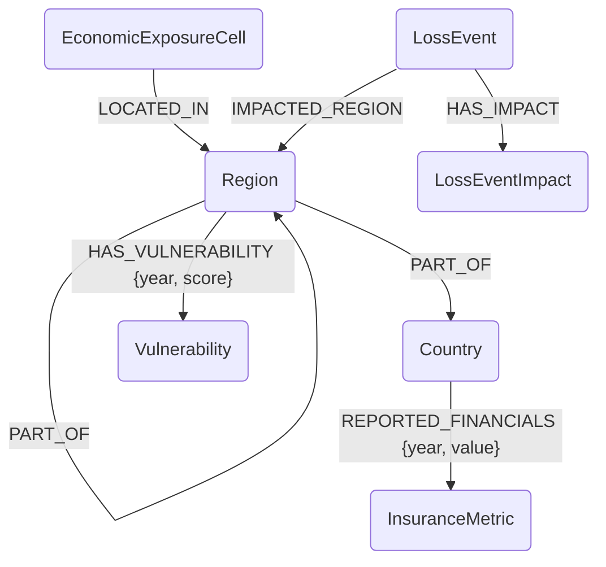

# Graph Model Documentation

This document describes the graph data model implemented in `loader.ipynb` for the Insurance Geo-Analytics project. The model integrates spatial data, economic exposure, risk vulnerability, and financial metrics.

## Schema Overview

The graph is centered around **Locations (Regions)** which are linked to **Risks (Vulnerabilities, Loss Events)** and **Financial Capacity (Insurance Metrics)**.

## Nodes

### `Country`
Represents a top-level administrative country.
*   **Properties:**
    *   `iso_a3` (String): ISO 3-digit country code (e.g., "BEL"). Unique Constraint.
    *   `iso_a2` (String): ISO 2-digit country code.
    *   `name` (String): Full country name.

### `Region`
Represents an administrative unit (NUTS1, NUTS2, NUTS3).
*   **Properties:**
    *   `nuts_code` (String): NUTS classification code. Unique Constraint.
    *   `name` (String): Region name.
    *   `level` (Integer): NUTS level (1, 2, or 3). Indexed.
    *   `mount_type` (Integer): Mountainous terrain classification.
    *   `urbn_type` (Integer): Urban-rural typology.
    *   `coast_type` (Integer): Coastal territory classification.

### `EconomicExposureCell`
Represents a granular spatial unit of economic exposure (from LitPop).
*   **Properties:**
    *   `cell_code` (String): Unique identifier based on lat/lon. Unique Constraint.
    *   `lat` (Float): Latitude.
    *   `lon` (Float): Longitude.
    *   `value` (Float): Total Insurable Value (proxy).

### `Vulnerability`
Defines a specific type of risk vulnerability (e.g., social, economic).
*   **Properties:**
    *   `code` (String): Unique vulnerability code. Unique Constraint.
    *   `name` (String): Description of the vulnerability measure.
    *   `parent_category` (String): Higher-level capability or category.

### `InsuranceMetric`
Defines a financial insurance statistic (e.g., from EIOPA).
*   **Properties:**
    *   `code` (String): Unique metric identifier. Unique Constraint.
    *   `name` (String): Name of the metric (e.g., "Gross Written Premiums").
    *   `business_type` (String): Line of business.

### `LossEvent`
Represents a historical natural catastrophe event.
*   **Properties:**
    *   `event_code` (String): Unique event identifier. Unique Constraint.
    *   `hazard_type` (String): Type of hazard (e.g., "Flood"). Indexed.
    *   `hazard` (String): Specific hazard name.
    *   `hazard_subtype` (String): Subtype of the hazard.
    *   `hazard_group_name` (String): Group of hazards (e.g., "Natural").
    *   `asset` (String): Asset class affected.
    *   `event_name` (String): Name of the event.
    *   `start_date` (Date): Start date of the event.
    *   `end_date` (Date): End date of the event.
    *   `year` (Integer): Year of the event. Indexed.
    *   `nuts_level` (Integer): Administrative level of the reported event.

### `LossEventImpact`
Represents the specific impact metrics of a loss event.
*   **Properties:**
    *   `event_code` (String): Link to the parent event.
    *   `metric` (String): Type of impact metric (e.g., "Economic Loss").
    *   `value` (Float): Value of the impact.
    *   `year` (Integer): Year of impact.

## Relationships

| Relationship Type | Source Node | Target Node | Properties | Description |
| :--- | :--- | :--- | :--- | :--- |
| `PART_OF` | `Region` | `Region` | | Hierarchy: NUTS3 -> NUTS2 -> NUTS1 |
| `PART_OF` | `Region` | `Country` | | Hierarchy: NUTS1 -> Country |
| `LOCATED_IN` | `EconomicExposureCell` | `Region` | | Spatial containment of exposure cells in NUTS3 regions. |
| `HAS_VULNERABILITY` | `Region` | `Vulnerability` | `year` (Int), `score` (Float) | Connects regions to their vulnerability scores for a specific year. |
| `REPORTED_FINANCIALS` | `Country` | `InsuranceMetric` | `year` (Int), `value` (Float) | Financial statistics for a country by year. |
| `IMPACTED_REGION` | `LossEvent` | `Region` | | Links a loss event to the administrative region where it occurred. |
| `HAS_IMPACT` | `LossEvent` | `LossEventImpact` | | Connects an event to its detailed impact metrics. |

## Constraints & Indexes

The following constraints and indexes are applied to ensure data integrity and query performance:

### Uniqueness Constraints
*   `Country.iso_a3`
*   `Region.nuts_code`
*   `EconomicExposureCell.cell_code`
*   `Vulnerability.code`
*   `InsuranceMetric.code`
*   `LossEvent.event_code`

### Indexes
*   `Region.level`
*   `LossEvent.hazard_type`
*   `LossEvent.year`
