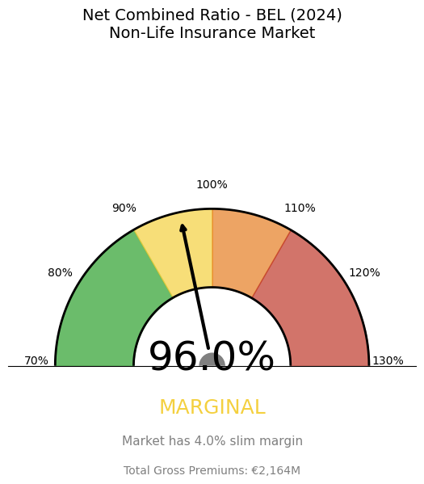
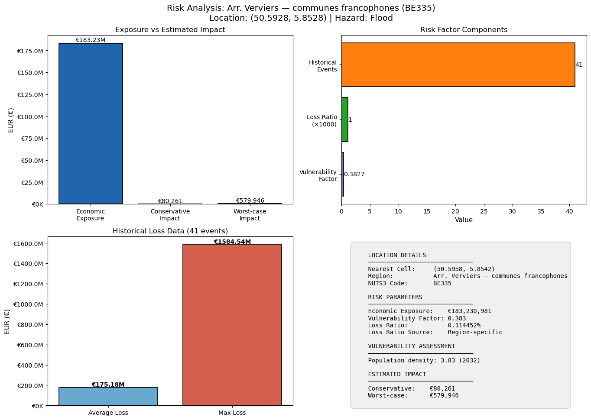
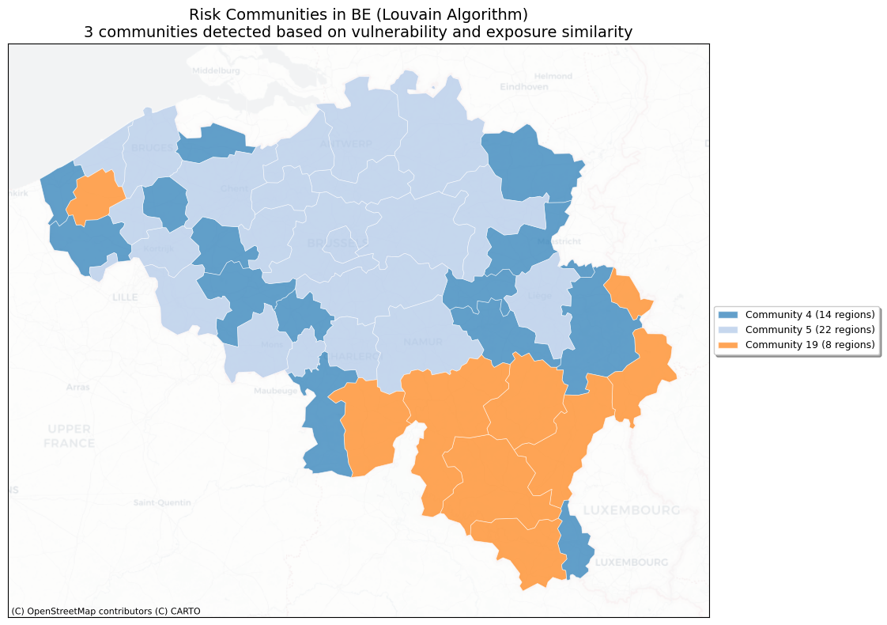
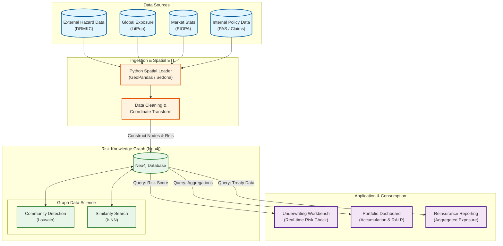

# Insurance & Natural Disasters Knowledge Graph

This project implements a [Graph Data Science](https://neo4j.com/product/graph-data-science/) workflow to bridge the gap between **Physical Risk** (Natural Disasters) and **Financial Protection** (Insurance Penetration). By integrating disparate spatial, economic, and historical loss datasets into a unified Neo4j Knowledge Graph, we can perform advanced accumulation control, protection gap analysis, and risk community detection.

It intends to show prospective customers in the Insurance and Risk Management space how Neo4j can act as a geo aware datastore, while enriching internal policy data with external hazard landscapes to reveal hidden correlations and spatial dependencies that traditional relational databases miss.

The resulting Knowledge Graph serves as a dynamic risk engine. Instead of viewing a property as a static row in a table, we model it as a node connected to a web of environmental and economic factors. This allows insurers to move beyond simple "zip code" underwriting to hyper-local risk assessment.

<p align="center">
  
  <br>
  <sub>Vulnerability-Adjusted Economic Exposure Map (30 arc-second resolution)</sub>
</p>


## Business Context

Natural catastrophes (NatCat) pose significant risks to insurers and reinsurers. Effectively managing these risks requires a deep understanding of how economic exposure, hazard vulnerability, and financial capacity interact. Economic exposure refers to the value of assets at risk, while hazard vulnerability describes how susceptible those assets are to damage from natural events. Financial capacity, on the other hand, is the insurance market's ability to absorb losses when disasters strike.

This project demonstrates how Re/Insurers can leverage Neo4j as a data store to answer critical business questions. For example, it enables the identification of accumulation hotspots-areas where high economic value coincides with high vulnerability. It also helps to reveal protection gaps by highlighting regions with high expected losses but stressed insurance markets. Finally, we demonstrate how unsupervised similarity detection algorithms available in Neo4j can be used to identify **risk communities**, allowing users to find regions that share similar multidimensional risk profiles.

### Glossary of Key Terms

- **Accumulation Risk**: The risk that an insurance company faces when it has a high concentration of insured exposures in a single geographic area, making it vulnerable to a single catastrophic event (e.g., a hurricane or flood) impacting many policies simultaneously.
- **Economic Exposure**: The total monetary value of people, property, and assets located in hazard-prone areas that are susceptible to loss, regardless of whether they are insured.
- **Expected Annual Loss (EAL)**: A statistical risk metric representing the average loss occurring over a long period. In insurance pricing, it serves as the baseline for the "risk premium" required to cover long-term claims.
- **Hazard Vulnerability**: The degree to which an asset (e.g., a residential building) is susceptible to damage when exposed to a specific peril of a certain intensity (e.g., flood depth or wind speed).
- **Net Combined Ratio**: A key measure of insurer profitability calculated as the sum of incurred losses and operating expenses divided by earned premiums. A ratio above 100% indicates an underwriting loss (paying out more than is collected), while below 100% indicates profit.
- **Protection Gap**: The difference between total economic losses caused by a disaster and the portion covered by insurance. A large gap places the burden of recovery on governments, businesses, and individuals.
- **Risk-Adjusted Loss Potential (RALP)**: A composite metric introduced in this project that weights Expected Annual Loss (EAL) by the local insurance market's capacity (Combined Ratio). It highlights "hotspots" where physical risk is high and financial resilience is low.
- **Total Insurable Value (TIV)**: The aggregate maximum value of an insured portfolio, usually representing the full replacement cost of all insured properties and contents in a given region.

## Data Sources

The Knowledge Graph is built using a Spatial ETL pipeline ingesting the following open datasets:

The Knowledge Graph is built using a Spatial ETL pipeline ingesting several open datasets. [**LitPop**](https://www.research-collection.ethz.ch/entities/researchdata/12dcfc4f-9d03-463a-8d6b-76c0dc73cdc8) provides global exposure data serving as a proxy for Total Insurable Value (TIV) at a 30 arc-second resolution (~1km). [**EIOPA**](https://www.eiopa.europa.eu/tools-and-data/insurance-statistics_en#premiums-claims-and-expenses) supplies insurance statistics including aggregated premiums, claims, and expenses for market intelligence. Finally, [**DRMKC**](https://drmkc.jrc.ec.europa.eu/risk-data-hub) contributes vulnerability indicators and historical loss event catalogs for floods, storms, and earthquakes.

## Project Structure

The project is organized into several key files. **[`loader.ipynb`](loader.ipynb)** handles ETL and graph construction, managing data ingestion, spatial processing, and loading of nodes and relationships into Neo4j. **[`analysis.ipynb`](analysis.ipynb)** is used for analytics and inference, querying the constructed graph to calculate risk metrics, visualize exposure, and detect communities. **[`MODEL.md`](MODEL.md)** contains the detailed data model documentation, specifying the graph schema, nodes, relationships, and properties. Finally, **[`environment.yml`](environment.yml)** provides the Conda environment definition.

## Graph Data Model

The schema centers on **Location (Region)** as the unifying entity, connecting the Geo-Spatial, Risk, and Financial domains.

> [!TIP]
> For a comprehensive definition of all Nodes, Relationships, and Properties, please refer to the **[Graph Model Documentation](MODEL.md)**.

### High-Level Schema

The schema connects various entities to form a comprehensive risk model. **`(:EconomicExposureCell)-[:LOCATED_IN]->(:Region)`** represents granular exposure units (LitPop) aggregated into NUTS3 administrative regions. These regions are further characterized by **`(:Region)-[:HAS_VULNERABILITY]->(:Vulnerability)`**, which links socio-economic vulnerability scores to specific areas. Historical context is provided by **`(:LossEvent)-[:IMPACTED_REGION]->(:Region)`**, connecting catastrophe events to the areas they impacted. At a higher level, **`(:Country)-[:REPORTED_FINANCIALS]->(:InsuranceMetric)`** links financial KPIs such as GWP, claims, and ratios to the top-level country node.

<p align="center">
  
  <br>
  <sub>The Graph Schema</sub>
</p>

## Data Loading & Spatial ETL ([`loader.ipynb`](loader.ipynb))

The loader notebook handles the ingestion of high-resolution grid data and performs spatial joins to map economic exposure to the [NUTS](https://ec.europa.eu/eurostat/web/nuts) administrative hierarchy (NUTS1/2/3).

### Economic Exposure (TIV)

We load LitPop data to visualize Total Insurable Value density. Below is the economic exposure grid for Belgium.

### Aggregation

The granular cells are spatially joined with NUTS3 polygons to allow for regional reporting.

## Risk Analysis & Insights ([`analysis.ipynb`](analysis.ipynb))

The analysis notebook queries the graph to estimate risk, calculate protection gaps, and detect communities.

### National Insurance Market Capacity

We calculate the **Net Combined Ratio** from EIOPA data. A ratio > 100% indicates a stressed market (unprofitable underwriting), while < 100% indicates capacity to absorb new losses.

<p align="center">
  
  <br>
  <sub>Net Combined Ratio for BEL</sub>
</p>

### Empirical Loss Ratios

By analyzing historical `LossEvent` nodes, we calculate empirical loss ratios for Floods, Storms, and Earthquakes per region.

### Location-Specific Risk Assessment

We can query the graph for any specific coordinate (e.g., Verviers in Belgium, which is a flood prone region) to estimate potential impacts. The model combines local exposure, regional vulnerability, and historical loss ratios to calculate **Conservative** vs. **Worst-Case** impact estimates.

<p align="center">
  
  <br>
  <sub>Location Specific Risk Dashboard</sub>
</p>

### Regional Risk Mapping

Extending the point-based analysis, we generate risk maps for entire NUTS2 regions, highlighting areas with the highest potential financial impact from specific hazards.

<p align="center">
  
  <br>
  <sub>Location Specific Risk Map</sub>
</p>

## The Protection Gap Analysis

A key output of this project is the **Risk-Adjusted Loss Potential (RALP)**. This metric identifies regions where high Expected Annual Losses (EAL) coincide with a stressed insurance market.

### Dashboard: EAL vs RALP

This dashboard visualizes the "Risk Hotspots" - regions where disasters would cause economic shock that insurance cannot absorb.

<p align="center">
  
  <br>
  <sub>Risk Adjusted Loss Projections</sub>
</p>

### Bivariate Heatmap: The Sub-National Protection Gap

This map encodes two dimensions:

This map encodes two dimensions: **Expected Annual Loss** (Physical Risk) on the horizontal axis and **Insurance Market Stress** (Financial Capacity) on the vertical axis.

<p align="center">
  
  <br>
  <sub>Bivariate Protection Gap Heatmap</sub>
</p>

## Graph Data Science: Community Detection

Using the **Louvain Algorithm** via the Neo4j Graph Data Science (GDS) library, we project a graph based on vulnerability and economic exposure similarity (k-NN). This identifies natural clusters of regions with similar risk profiles, useful for portfolio segmentation.

<p align="center">
  
  <br>
  <sub>Similar Risk Communities in BEL</sub>
</p>

## Potential Architecture for Productionization

In a production enterprise environment, we move away from siloed data lakes toward an operational graph that serves real-time underwriting and strategic portfolio management.

The following diagram illustrates how this solution could fit into a modern insurance technology stack:



#### Core Components

***Data Ingestion Layer (Spatial ETL)***

The **Data Ingestion Layer (Spatial ETL)** connects to external feeds like DRMKC in our example and bulk data sources such as LitPop and EIOPA for hazard and economic data. It also ingests internal data from policy administration systems (PAS) and claims databases. Geospatial processing is handled using Python (GeoPandas) or Apache Sedona to perform coordinate transformations and spatial joins before graph loading.


***The Risk Knowledge Graph (Neo4j)***

The **Risk Knowledge Graph (Neo4j)** acts as the "Golden Record" for Risk, centrally linking Policyholders, Physical Assets, Hazards, and Financial Capacity. It leverages Graph Data Science (GDS) to run in-database algorithms like Louvain and k-NN, allowing the system to compute similarity scores and detect risk communities without moving data.


***Application Layer***

The **Application Layer** relies on an Underwriting Workbench that queries the graph in real-time (via GraphQL or Bolt) to fetch "risk proximity" scores for a specific address during the quoting process. A Portfolio Dashboard visualizes accumulation risk and protection gaps (as seen in the RALP analysis), while Reinsurance Reporting aggregates graph data to report total exposure by hazard zones for treaty negotiations.

#### Enterprise Integration Flow

The following sequence diagram illustrates how a new insurance quote request would flow through this architecture, leveraging the graph for real-time risk assessment:

```mermaid
sequenceDiagram
    autonumber
    actor C as Customer/Broker
    participant UW as Underwriting Workbench
    participant KG as Knowledge Graph (Neo4j)
    participant RE as Risk Engine

    Note over C, UW: 1. Submission
    C->>UW: Quote Request (Lat/Lon, Asset Value)

    Note over UW, KG: 2. Graph Entry Point
    UW->>KG: MATCH (:EconomicExposureCell) closest to Lat/Lon

    Note over KG: 3. Graph Traversal (The "Golden Record")
    KG->>KG: Traverse [:LOCATED_IN] -> (:Region)<br/>(Identify NUTS3 Context)
    
    KG->>KG: Traverse (:Region)-[:HAS_VULNERABILITY]->(:Vulnerability)<br/>(Fetch Socio-Economic Score)
    
    KG->>KG: Traverse (:LossEvent)-[:IMPACTED_REGION]->(:Region)<br/>(Retrieve Historical Loss Frequency)
    
    KG->>KG: Traverse (:Region)-[:PART_OF]->(:Country)<br/>-[:REPORTED_FINANCIALS]->(:InsuranceMetric)<br/>(Check National Market Capacity)

    Note over KG, RE: 4. Risk Calculation
    KG-->>RE: Return Sub-Graph:<br/>- Cell Exposure Density<br/>- Region Vulnerability<br/>- Historical Event Count<br/>- Country Combined Ratio
    
    RE->>RE: Compute RALP (Risk-Adjusted Loss Potential)
    
    Note over RE, UW: 5. Decision
    RE-->>UW: Flag: "High Risk Accumulation"
    UW-->>C: Response: "Referral Required"
  ```

## Getting Started

### Prerequisites

To get started, you will need a **Neo4j Database** (AuraDB or a local instance) and **Python 3.11+** (we recommend using Conda or Mamba for environment management). You will also require an **API Token** for the [DRMKC Risk Data Hub](https://drmkc.jrc.ec.europa.eu/risk-data-hub-api/docs/) to access vulnerability and loss data.

### Installation

Begin by cloning the repository. Next, create and activate the environment by running `conda env create -f environment.yml` followed by `conda activate insurance-geo`.
Finally, configure the environment by creating a `.env` file in the root directory with the following content:
    ```bash
    NEO4J_URI=bolt://localhost:7687
    NEO4J_USER=neo4j
    NEO4J_PASSWORD=your_password
    ISO_A3_COUNTRY_CODE=BEL
    DRMKC_TOKEN=your_drmkc_token_here
    USD_TO_EUR=0.92
    ```

### Usage

To use the project, start by **ingesting data** using `loader.ipynb`. This notebook fetches external data (LitPop, DRMKC, EIOPA), performs spatial joins, and constructs the graph in Neo4j. Once the data is loaded, proceed to **analyze risk** with `analysis.ipynb`, which queries the graph for risk metrics and generates visualizations such as Choropleth maps and Protection Gap heatmaps.