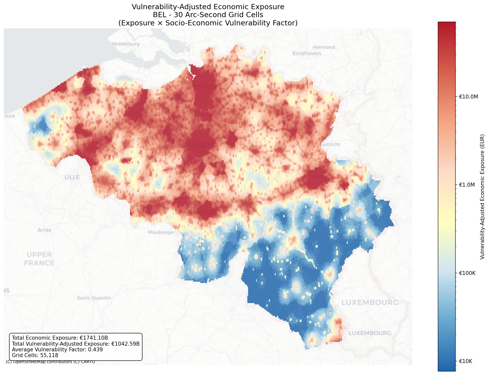
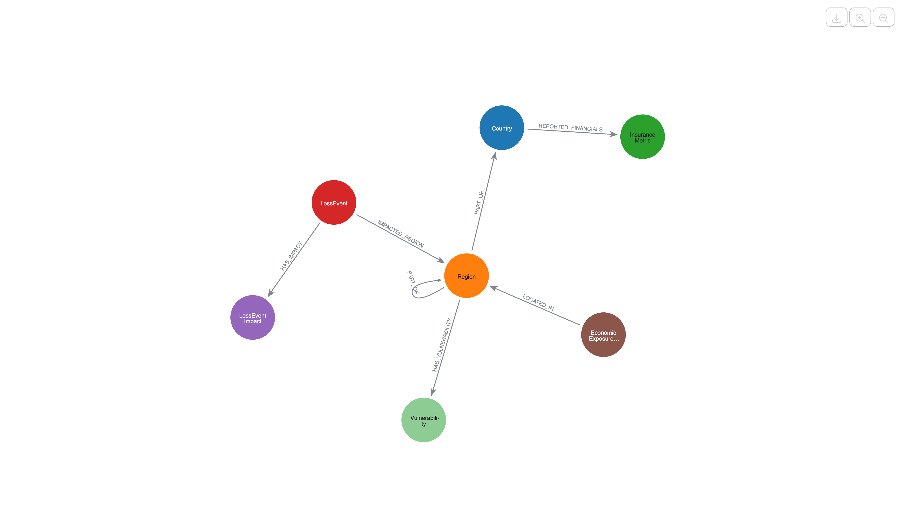
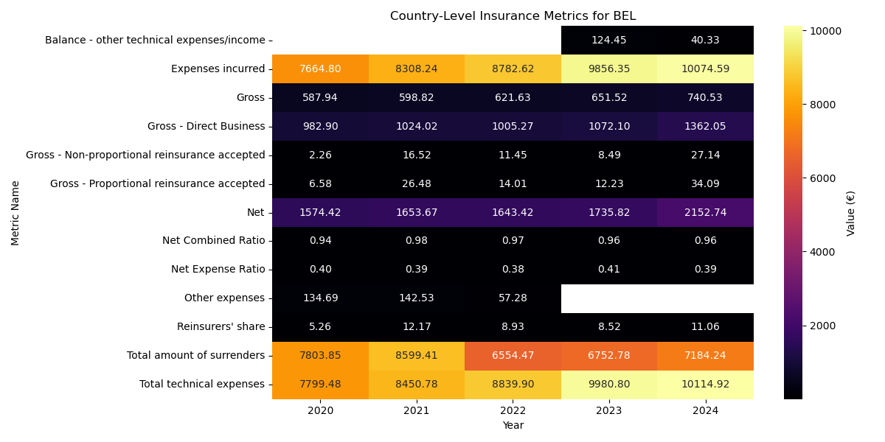
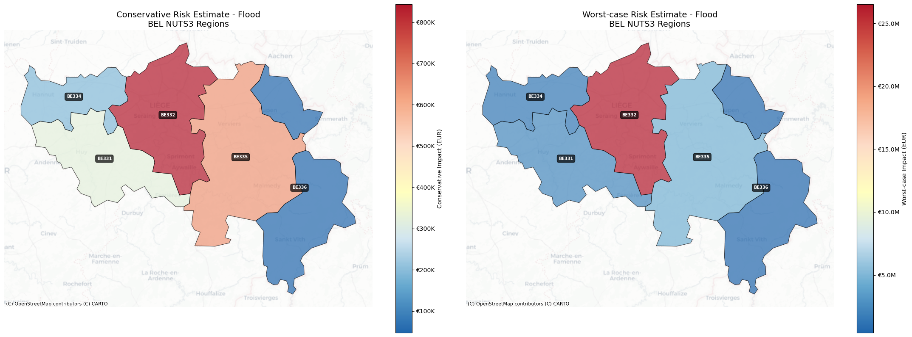
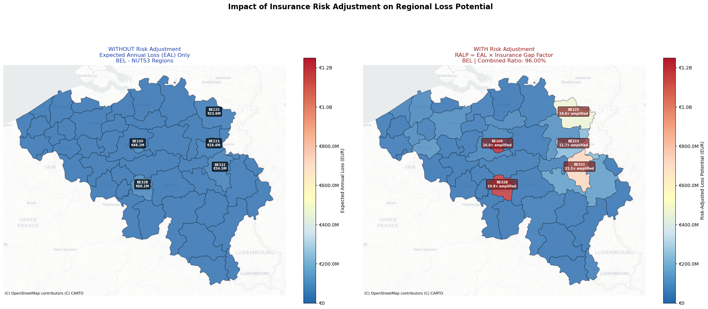
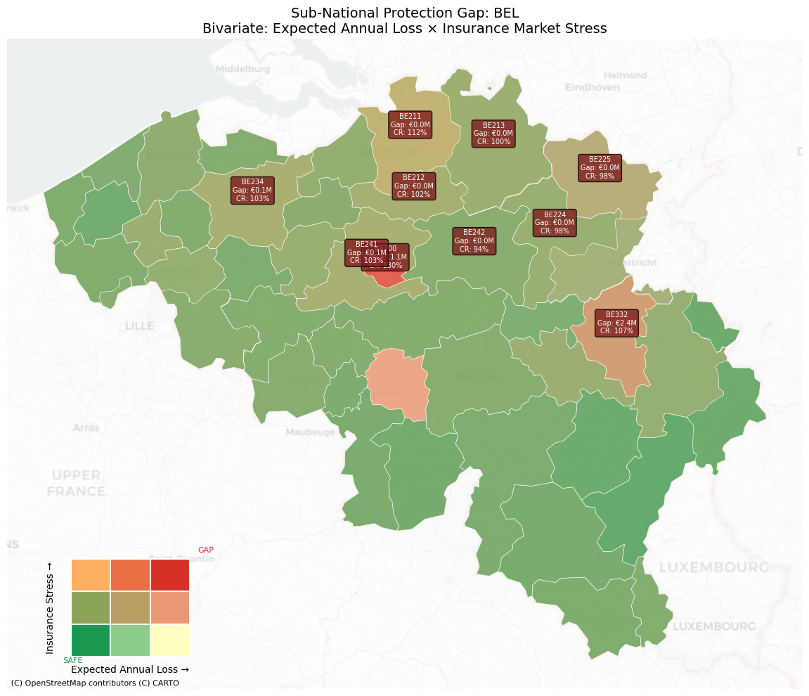

# Insurance & Natural Disasters Knowledge Graph

This project implements a [Graph Data Science](https://neo4j.com/product/graph-data-science/) workflow to bridge the gap between **Physical Risk** (Natural Disasters) and **Financial Protection** (Insurance Penetration). By integrating disparate spatial, economic, and historical loss datasets into a unified Neo4j Knowledge Graph, we can perform advanced accumulation control, protection gap analysis, and risk community detection.

It intends to show prospective customers in the Insurance and Risk Management space how Neo4j can act as a geo aware datastore, while enriching internal policy data with external hazard landscapes to reveal hidden correlations and spatial dependencies that traditional relational databases miss.

The resulting Knowledge Graph serves as a dynamic risk engine. Instead of viewing a property as a static row in a table, we model it as a node connected to a web of environmental and economic factors. This allows insurers to move beyond simple "zip code" underwriting to hyper-local risk assessment.

<p align="center">
  
  <br>
  <sub>Vulnerability-Adjusted Economic Exposure Map (30 arc-second resolution)</sub>
</p>


## Business Context

Natural catastrophes (NatCat) pose significant risks to insurers and reinsurers. Effectively managing these risks requires a deep understanding of how economic exposure, hazard vulnerability, and financial capacity interact. Economic exposure refers to the value of assets at risk, while hazard vulnerability describes how susceptible those assets are to damage from natural events. Financial capacity, on the other hand, is the insurance market's ability to absorb losses when disasters strike.

This project demonstrates how Re/Insurers can leverage Neo4j as a data store to answer critical business questions. For example, it enables the identification of accumulation hotspots-areas where high economic value coincides with high vulnerability. It also helps to reveal protection gaps by highlighting regions with high expected losses but stressed insurance markets. Finally, we demonstrate how unsupervised similarity detection algorithms available in Neo4j can be used to identify **risk communities**, allowing users to find regions that share similar multidimensional risk profiles.

## Data Sources

The Knowledge Graph is built using a Spatial ETL pipeline ingesting the following open datasets:

| Source | Dataset | Domain | Business Utility |
| --- | --- | --- | --- |
| [**LitPop**](https://www.research-collection.ethz.ch/entities/researchdata/12dcfc4f-9d03-463a-8d6b-76c0dc73cdc8) | Global Exposure Data | Exposure Management | Proxy for Total Insurable Value (TIV) at 30 arc-second resolution (~1km). |
| [**EIOPA**](https://www.eiopa.europa.eu/tools-and-data/insurance-statistics_en#premiums-claims-and-expenses) | Insurance Statistics | Market Intelligence | Aggregated Premiums, Claims & Expenses (Profitability & Capacity). |
| [**DRMKC**](https://drmkc.jrc.ec.europa.eu/risk-data-hub) | Risk Data Hub | Catastrophe Modelling | Vulnerability indicators and historical loss event catalogs (Flood, Storm, Earthquake). |

## Graph Data Model

The schema centers on **Location (Region)** as the unifying entity, connecting the Geo-Spatial, Risk, and Financial domains.

### Nodes & Relationships

* **`(:EconomicExposureCell)-[:LOCATED_IN]->(:Region)`**: Granular exposure units (LitPop) aggregated into NUTS3 administrative regions.
* **`(:Region)-[:HAS_VULNERABILITY]->(:Vulnerability)`**: Socio-economic vulnerability scores linked to regions.
* **`(:LossEvent)-[:IMPACTED_REGION]->(:Region)`**: Historical catastrophe events linked to the areas they impacted.
* **`(:Country)-[:REPORTED_FINANCIALS]->(:InsuranceMetric)`**: Financial KPIs (GWP, Claims, Ratios) linked to the top-level country node.

<p align="center">
  
  <br>
  <sub>The Graph Schema</sub>
</p>

## Data Loading & Spatial ETL ([`loader.ipynb`](loader.ipynb))

The loader notebook handles the ingestion of high-resolution grid data and performs spatial joins to map economic exposure to the [NUTS](https://ec.europa.eu/eurostat/web/nuts) administrative hierarchy (NUTS1/2/3).

### Economic Exposure (TIV)

We load LitPop data to visualize Total Insurable Value density. Below is the economic exposure grid for Belgium.

### Aggregation

The granular cells are spatially joined with NUTS3 polygons to allow for regional reporting.

## Risk Analysis & Insights ([`analysis.ipynb`](analysis.ipynb))

The analysis notebook queries the graph to estimate risk, calculate protection gaps, and detect communities.

### National Insurance Market Capacity

We calculate the **Net Combined Ratio** from EIOPA data. A ratio > 100% indicates a stressed market (unprofitable underwriting), while < 100% indicates capacity to absorb new losses.

<p align="center">
  
  <br>
  <sub>Risk Adjusted Loss Projections</sub>
</p>

### Empirical Loss Ratios

By analyzing historical `LossEvent` nodes, we calculate empirical loss ratios for Floods, Storms, and Earthquakes per region.

### Location-Specific Risk Assessment

We can query the graph for any specific coordinate (e.g., Verviers in Belgium, which is a flood prone region) to estimate potential impacts. The model combines local exposure, regional vulnerability, and historical loss ratios to calculate **Conservative** vs. **Worst-Case** impact estimates.

### Regional Risk Mapping

Extending the point-based analysis, we generate risk maps for entire NUTS2 regions, highlighting areas with the highest potential financial impact from specific hazards.

<p align="center">
  
  <br>
  <sub>Location Specific Risk Map</sub>
</p>

## The Protection Gap Analysis

A key output of this project is the **Risk-Adjusted Loss Potential (RALP)**. This metric identifies regions where high Expected Annual Losses (EAL) coincide with a stressed insurance market.

### Dashboard: EAL vs RALP

This dashboard visualizes the "Risk Hotspots"—regions where disasters would cause economic shock that insurance cannot absorb.

<p align="center">
  
  <br>
  <sub>Risk Adjusted Loss Projections</sub>
</p>

### Bivariate Heatmap: The Sub-National Protection Gap

This map encodes two dimensions:

- Expected Annual Loss (Horizontal): Physical Risk.
- Insurance Market Stress (Vertical): Financial Capacity.

<p align="center">
  
  <br>
  <sub>Bivariate Protection Gap Heatmap</sub>
</p>

## Graph Data Science: Community Detection

Using the **Louvain Algorithm** via the Neo4j Graph Data Science (GDS) library, we project a graph based on vulnerability and economic exposure similarity (k-NN). This identifies natural clusters of regions with similar risk profiles, useful for portfolio segmentation.

## Getting Started

### Prerequisites

- Neo4j Database (AuraDB or Local)
- Python 3.8+
- DRMKC API Token (Required for vulnerability/loss data)

You can create a free Neo4j AuraDB instance [here](https://neo4j.com/cloud/aura/). Make sure to note down your connection URI, username, and password for the environment setup.

To register for a DRMKC API token, visit the [DRMKC Risk Data Hub API documentation](https://drmkc.jrc.ec.europa.eu/risk-data-hub-api/docs/) and follow their instructions to obtain access.

### Environment Setup

Create a `.env` file in the root directory:

```bash
NEO4J_URI=bolt://localhost:7687
NEO4J_USER=neo4j
NEO4J_PASSWORD=your_password
ISO_A3_COUNTRY_CODE=BEL
DRMKC_TOKEN=your_token_here
USD_TO_EUR=0.92
```

You can set the target country for the analysis by changing the `ISO_A3_COUNTRY_CODE` variable (e.g., "FRA" for France, "ITA" for Italy). Before running the notebooks, ensure you have downloaded the necessary `LitPop` and `EIOPA` datasets and placed them in the `.data/` directory as per the instructions in `loader.ipynb`.

> Note that for large countries with many NUTS3 regions, the spatial joins and graph loading may require significant memory in your Neo4j instance. Consider starting with a smaller country (e.g., Belgium) for initial testing.